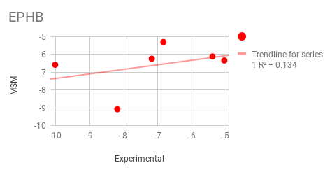
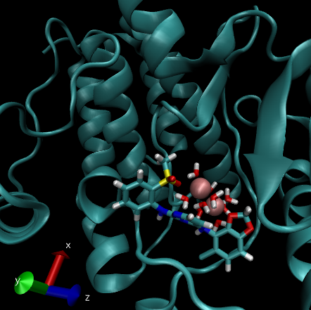

==========
Benchmark
==========

.. toctree::
   :maxdepth: 2

Urokinase
----------

Urokinase is a serine protease was originally isolated from human urine, and it is also present in the blood and in the extracellular matrix of many tissues. The primary physiological substrate of this enzyme is plasminogen, which is an inactive form (zymogen) of the serine protease plasmin. Activation of plasmin triggers a proteolytic cascade that, depending on the physiological environment, participates in thrombolysis or extracellular matrix degradation.

Ligands: We benchmark 5 different inhibitors starting from docking position with QM charges
        
        - 239 (40 nM)
        - 7UP (59 nM)
        - 4UP (610 nM)
        - 675 (628 nM)
        - 1UP (637 nM)
        - 2UP (5910 nM)

Results:

.. figure:: URO.png
  :scale: 80%
  :align: center
  :alt: Install need it plugin to visualize the Adaptive exit simulation

  MSM PELE results for Urikonase protein
 

Progesterone Receptor
----------------------

Progesterone is necessary to induce the progesterone receptors. When no binding hormone is present the carboxyl terminal inhibits transcription. Binding to a hormone induces a structural change that removes the inhibitory action. Progesterone antagonists prevent the structural reconfiguration. 

Ligands: We benchmark 5 different inhibitors starting from docking position with QM charges

        - STR (50 nM)
        - 400 (68 nM)
        - AS4 (248.5 nM)
        - HCY (4499 nM)
        - 356 (50000 nM)

Results:

.. figure:: PR.png
  :scale: 80%
  :align: center
  :alt: Install need it plugin to visualize the Adaptive exit simulation

  MSM PELE results for Progesteron Receptor inhibitors

ERK2
------

Mitogen-activated protein kinase 1 (MAPK1) is also known as "extracellular signal-regulated kinase 2" (ERK2). Extracellular signal–regulated kinases (ERKs) or classical MAP kinases are widely expressed protein kinase intracellular signalling molecules that are involved in functions including the regulation of meiosis, mitosis, and postmitotic functions in differentiated cells. Many different stimuli, including growth factors, cytokines, virus infection, ligands for heterotrimeric G protein-coupled receptors, transforming agents, and carcinogens, activate the ERK pathway.

Ligands: We benchmark 5 different inhibitors starting from docking position with QM charges

        - E63 (15.1 nM)
        - EK6 (18.1 nM)
        - EK9 (20 nM)
        - EK2 (812.8 nM)
        - EK3 (2570 nM)

Results:

.. figure:: ERK2.png
  :scale: 80%
  :align: center
  :alt: Install need it plugin to visualize the Adaptive exit simulation

  MSM PELE results for MAPK1

COMT
------

La Catecol-O-metiltransferasa es una de las varias enzimas que degradan las catecolaminas (tales como la dopamina, adrenalina y noradrenalina) en los seres humanos. Debido a que la regulación de las catecolaminas se encuentra alterada en varias condiciones médicas, se han desarrollado varias drogas terapéuticas que hacen diana sobra la COMT con el objetivo de alterar su actividad y por lo tanto modificar la biodisponibilidad de las catecolaminas.

Ligands: We benchmark 2 extremely different receptor conformation with 3 ligands each

        - COMT (1)
                + 6P2 (75 nM)
                + 6P1 (86 nM)
                + 6OZ (1100 nM)

        - COMT (2)
                + 6P5 (11000 nM)
                + 6OW (85000 nM)
                + 6P4 (80000 nM)

Results:

.. figure:: COMT.png
  :scale: 80%
  :align: center
  :alt: Install need it plugin to visualize the Adaptive exit simulation

  MSM PELE results for MAPK1

Plami
------

Plasmin is an important enzyme (EC 3.4.21.7) present in blood that degrades many blood plasma proteins, including fibrin clots. The degradation of fibrin is termed fibrinolysis. In humans, the plasmin protein is encoded by the PLG gene. Plasmin deficiency may lead to thrombosis, as clots are not adequately degraded.

Ligands: We benchmark 5 similar inhibitors with very narrow activity range (almost inside the experimental range of error) starting from docking position with QM charges

        - L01 (7 microM)
        - L02 (5 microM)
        - L03 (4 microM)
        - L06 (5 microM)
        - L07 (7.3 microM)
        - L15 (6.9 microM)

Results:

.. figure:: Plasmi.png
  :scale: 80%
  :align: center
  :alt: Install need it plugin to visualize the Adaptive exit simulation

  MSM PELE results for Plasmin Protein

EPHB
------

Eph receptors (Ephs, after erythropoietin-producing human hepatocellular receptors) are a group of receptors that are activated in response to binding with Eph receptor-interacting proteins (Ephrins). Ephs form the largest known subfamily of receptor tyrosine kinases (RTKs). Both Eph receptors and their corresponding ephrin ligands are membrane-bound proteins that require direct cell-cell interactions for Eph receptor activation. Eph/ephrin signaling has been implicated in the regulation of a host of processes critical to embryonic development including axon guidance, formation of tissue boundaries, cell migration, and segmentation.

Ligands: We benchmark 5 different inhibitors with very narrow activity range starting from docking position with QM charges

        - L01 (2 microM)
        - L02 (77 microM)
        - L03 (580 microM)
        - L04 (1150 microM)
        - L05 (20490 microM)
        - L16 (41000 microM)

Results:

  MSM PELE results for EPHB

As we can see results are pretty bad for EPBH. By looking at the PMF of the system automatically produced by the software we can observe a strong outlier outside the binding site. By inspection we can realize that the ligand get trap near the two magnesium coordinating the protein in another pocket. Probable, a forcefield artefact due to magnesium are parametrized as two +2 ions.

  Ligand trapped by the magnesiums ions

