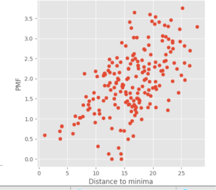

.. _tutorial:

========
Tutorial
========

This section will walk you through your first MSM job  and posterior analysis.
We will apply MSM_PELE over a already docked progesteron receptor inhibitor.

Launch the job
---------------
::
    
    python -m MSM_PELE.main <complex.pdb> <resname> <chain> --cpus <cpus> --iterations <n_repetitions>

    python -m MSM_PELE.main MSM_PELE/Examples/PR_1A28_xray_-_minimized.pdb STR Z --cpus 120 --iterations 3

Analise the exit path
-----------------------------

First, a complete in-out simulation (from minimum SASA to SASA 1) is performed, and all conformations are
clusterize along the exit path. In order to ensure good correlation between ligand the next instructions should be followed::

      maestro <processed_input> <produced_box> <all_exit_path_clusters>
      maestro Pele_STR/PR_1A28_xray_-_minimized_processed.pdb Pele_STR/box.pdb Pele_STR/ouput_clustering/iteration_*/clustering_*_Kmeans.pdb

The user must check that all ligand's exit path simulations are similar (same exit path),
and that the shown clusters should be representative of the entire exit path (clusters scattered along the entire path)
otherwise simulation may not be comparable

The representative structure of each cluster for each iteration can be found under **PELE_STR/output_clustering/iteration_X**::

    maestro PELE_STR/ouput_clustering/iteration_X/initial_number_cluster.pdb

Analise the MC exploration
--------------------------------

An exhaustive PELE exploration and a posterior MSM analysis is performed 
starting from all the exit path clusters. There are several features we can check to know whether
the exploration was good enough. Run the next commands under **Pele_STR/output_pele/**:

`Transition Study`::

  python -m MSM_PELE.AdaptivePELE.analysis.adaptivePlot 5 6 1000 -rmsd | gnuplot -p

If there are some trajectories connecting the binding site to the bulk
as seen in the image we can presume the MSM states will be correctly
connected. If there would be no transitions between the low and high part
of the chart we would recommend to increase the temperature of the simulation
with --temp 1500 and rerun the MSM again.

.. figure:: transitions.png
    :align: center
    :alt: Install need it plugin to visualize the image

Analise the MSM
--------------------------

To check the validity of the final MSM we can check the most important clusters
to validate it's importance to the final dG.

`Visualizing the dG landscape`::

  display Pele_STR/ouput_pele/MSM_2(last msm folder)/PMF_plot/PMF*.png

The clusters close to the binding site (dist = 0-3) should be the lowest dG as they should represent the slowest
transitions between states while the clusters on the bulk should be the highest as they represent the
highest transitions path (less important). We are chasing a profile like the next:

.. figure:: PMF.png
    :align: center
    :alt: Install need it plugin to visualize the image

Sometimes false minimas may appear (next to metals or next to the protein surface). In order to avoid that we suggest to enter
your own box trying to exclude that part of the system from the simulation.

In order to include your own box pass the flag --box box.pdb and change the CENTER and RADIUS line inside the pdb as you want
to define the properties of the box/es (you can have more than one box per file).

If your PMF looks completely scatter with no minimum close to the binding site as the plot below and the box limitation does not make any change to the results,  your system may not suitable for a MSM_PELE calculation as PELE finds too many false positive. We are currently working on that problem.

`Visualizing most important Clusters`::

  python -m MSM_PELE.Analysis.extract_cluster_representative <initial_input>  <last_MSM_folder> --dgmin <min limit dG> --dgmax <max limit dg> --distmin <min limit distance> --distmax <max limit distance>

  python -m MSM_PELE.Analysis.extract_cluster_representative 4p1r_receptor_complex_processed.pdb 2KR output_pele/MSM_2/ --dgmin 0 --dgmax 2 --distmin 0 --distmax 6

This will create a folder called most_important_clusters with all the structures of the clusters laying inside the square
determined by dg [0 - 2] and dist [0 -6] on the PMF*.png plot. It is higly
important that the lowest dG clusters make sense to the user. (Close 
to binding site and making the reported catalytic interaction if known)

`Results`

If all the requisits before are met we can check the final results under: **Pele_STR/results**

Where we will find a final MSM pdf report with the final dG+-std together with a PMF, probability and transition plot.

